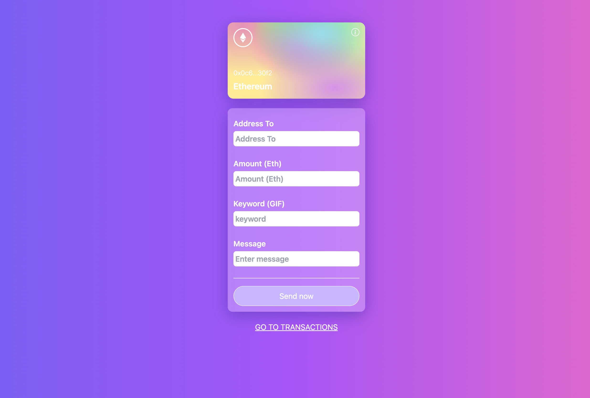
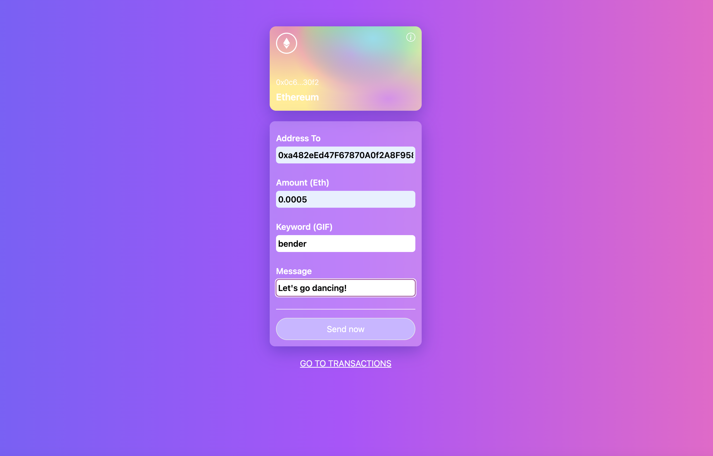
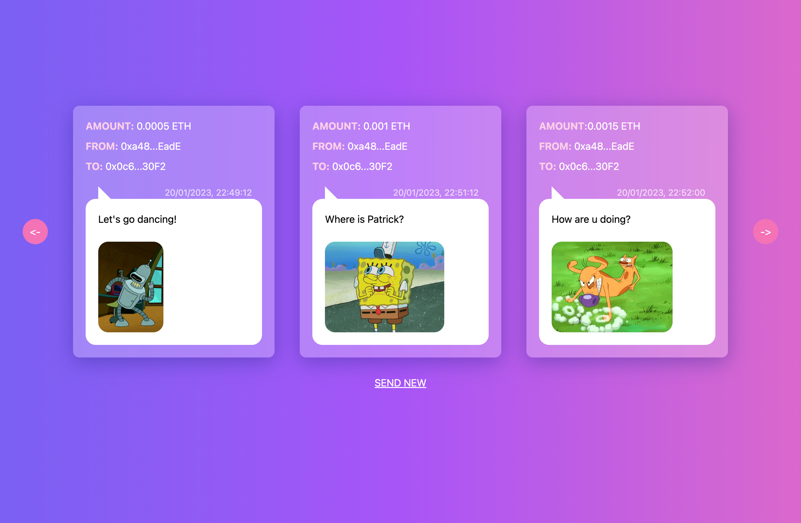

# simple-dapp

Web3 application for transfering ETH across the Goerli Test Network
And have fun with creating a small blog with notes and gifs

<table>
  <tr>
    <td>
      Step 1
      
    </td>
    <td>
      Step 2
      
    </td>
    <td>
      Step 3
      
    </td>
  </tr>
</table>